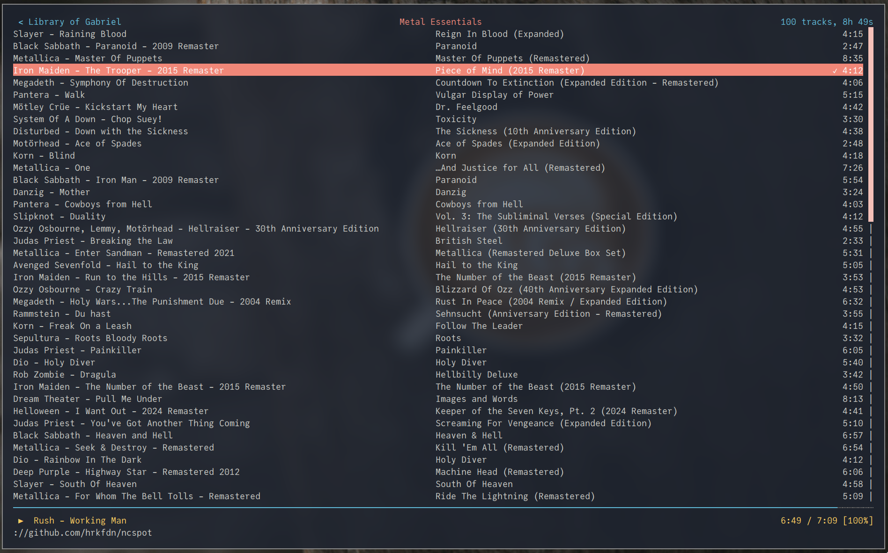
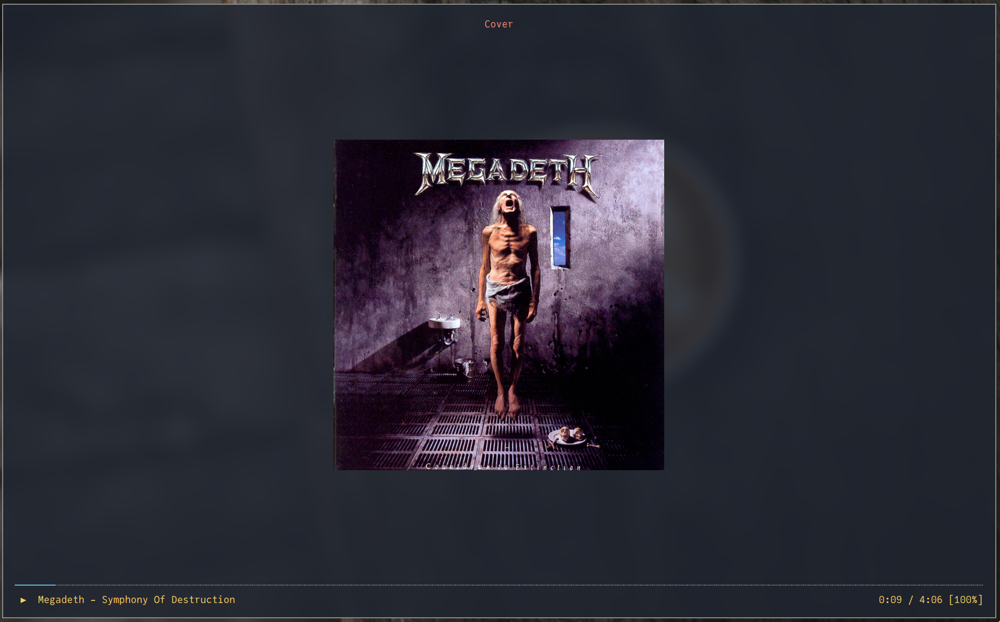

### This is a simple contribuition to Void Linux community.



`ncspot` compiled with `cover` feature.



**Requeriments:**
```
dbus, libncurses, libssl
libpulse
libxcb
ueberzug
```

You can check more in:
- New package request in [Void repo](https://github.com/void-linux/void-packages/pull/33600)
- The [main page](https://github.com/hrkfdn/ncspot) in Github

> If you have questions, please, open an issue! :)
